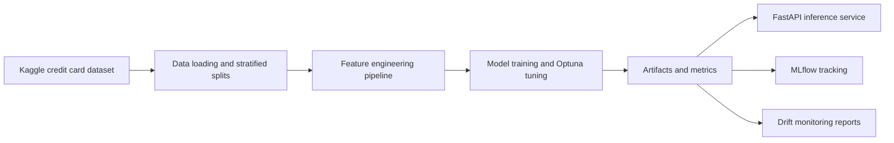

# Tabular ML

End-to-end tabular ML pipeline for credit card fraud detection with feature engineering, gradient boosting, FastAPI serving, MLflow tracking, and drift monitoring.

> Academic-project note: this repository is a portfolio and academic demonstration built on the public [Kaggle Credit Card Fraud Detection dataset](https://www.kaggle.com/datasets/mlg-ulb/creditcardfraud). It is designed to showcase reproducible ML engineering patterns, not to represent a production banking system.

## Overview

`tabular-ml` packages a full fraud-detection workflow around a heavily imbalanced binary classification problem:

- Exploratory data analysis in Jupyter.
- Reproducible feature engineering with a scikit-learn-compatible pipeline.
- Model training and tuning across XGBoost, LightGBM, and CatBoost.
- Ensemble evaluation with stacking and blending.
- FastAPI inference endpoints for single and batch predictions.
- MLflow experiment tracking and Evidently-based drift monitoring.

## Architecture



## Results Snapshot

| Model | Test PR-AUC | Test ROC-AUC | F1 | Precision | Recall |
|---|---:|---:|---:|---:|---:|
| XGBoost | 0.8672 | 0.9771 | 0.8817 | 0.9318 | 0.8367 |
| LightGBM | 0.8640 | 0.9708 | 0.8770 | 0.9213 | 0.8367 |
| CatBoost | 0.8376 | 0.9762 | 0.8265 | 0.8265 | 0.8265 |
| Stacking Ensemble | 0.8622 | 0.9782 | 0.8783 | 0.9121 | 0.8469 |
| Blending Ensemble | 0.8672 | 0.9771 | 0.8817 | 0.9318 | 0.8367 |

The current best standalone model is XGBoost on PR-AUC, while stacking slightly improves recall on the held-out test split.


## Quick Start

### 1. Create an environment

```bash
python3 -m venv .venv
source .venv/bin/activate
python -m pip install --upgrade pip
python -m pip install -e ".[dev]"
```

### 2. Download the dataset

```bash
kaggle datasets download -d mlg-ulb/creditcardfraud -p data/raw/ --unzip
```

The training pipeline expects `data/raw/creditcard.csv`.

### 3. Run the unit test suite

```bash
python -m pytest
```

Integration tests that require optional native ML libraries are marked with `integration` and will skip automatically if the dependency stack is unavailable.

### 4. Train models

```bash
python -m tabular_ml.models.train_all
python -m tabular_ml.models.run_ensemble
```

Generated artifacts are written to `artifacts/`, including trained models, plots, and result summaries.

### 5. Start the inference API

```bash
uvicorn tabular_ml.api.app:app --reload --port 8000
```

Endpoints:

- `GET /health`
- `POST /predict`
- `POST /predict/batch`

Example:

```bash
curl http://localhost:8000/health
```

### 6. Run drift monitoring

```bash
python scripts/monitoring_demo.py
```

### Optional: run API and MLflow with Docker Compose

```bash
docker compose up --build
```

Services:

- API docs: `http://127.0.0.1:8000/docs`
- MLflow UI: `http://127.0.0.1:5001`

## Training Hardware and Apple Silicon Notes

The repository now uses a documented backend preference in [`configs/default.yaml`](configs/default.yaml):

```yaml
training:
  hardware:
    preference: auto  # auto | cpu | gpu
```

- `auto` is the safe default and currently resolves to CPU.
- Apple Silicon machines resolve to CPU for this model stack because XGBoost, LightGBM, and CatBoost do not expose a native MPS backend in this project setup.
- Explicit `gpu` mode preserves the library-specific GPU settings where upstream support exists:
  - XGBoost: CUDA
  - LightGBM: OpenCL or CUDA-enabled build
  - CatBoost: GPU mode

On macOS, `xgboost` and `lightgbm` may require OpenMP:

```bash
brew install libomp
```

## Repository Layout

```text
src/tabular_ml/
  api/          FastAPI application and schemas
  data/         Data loading and splitting
  features/     Feature engineering pipeline
  models/       Training, tuning, evaluation, ensembles
  monitoring/   Evidently-based drift utilities
docs/
  images/       Exported figures used in project documentation
  project-overview.md
tests/          Unit and integration tests
configs/        YAML configuration
```

## Documentation

- Submission-ready project overview: [docs/project-overview.md](docs/project-overview.md)
- EDA notebook: [notebooks/01_eda.ipynb](notebooks/01_eda.ipynb)

The project overview is intentionally formatted as PDF-ready Markdown with Mermaid diagrams, image references, a title page, and an appendix.

## License

Released under the MIT License. See [LICENSE](LICENSE).
