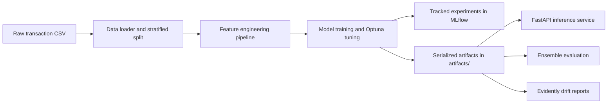
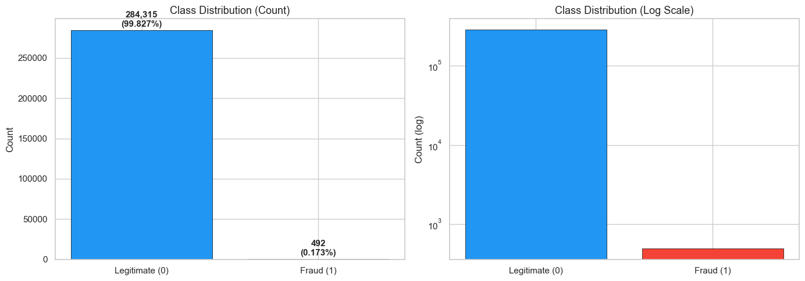
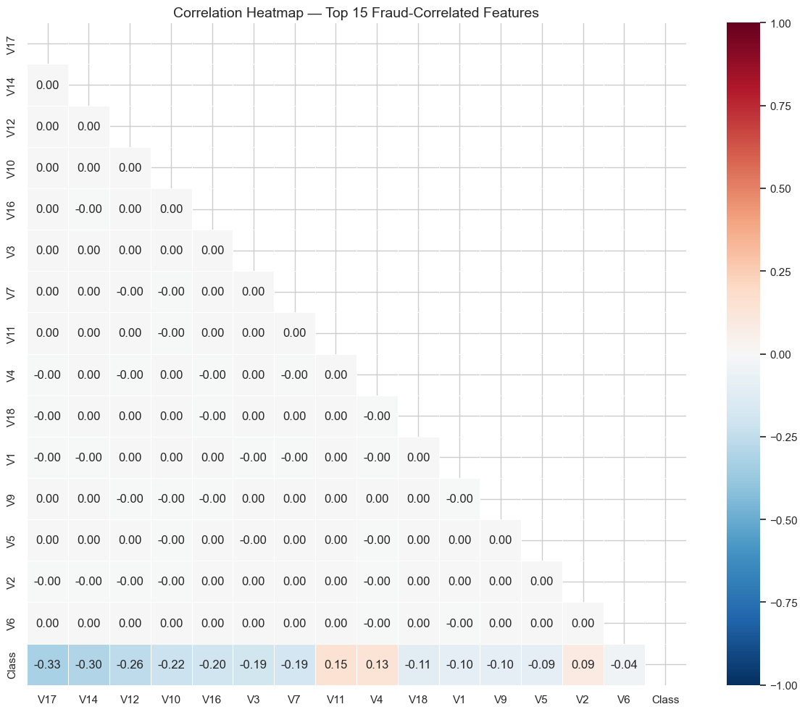
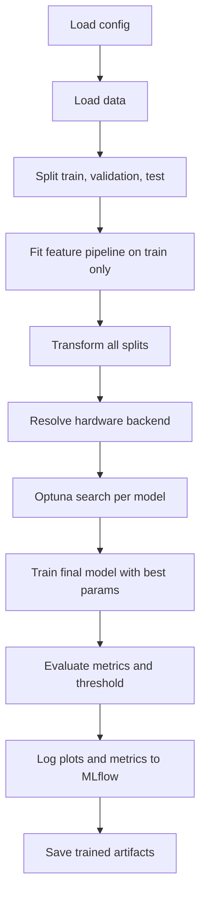
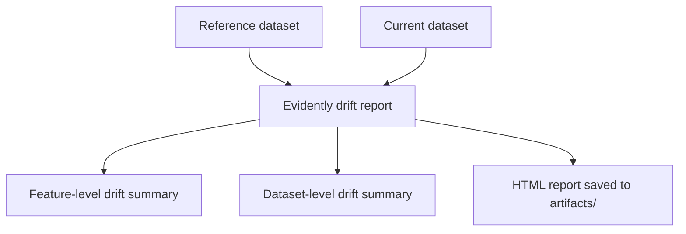
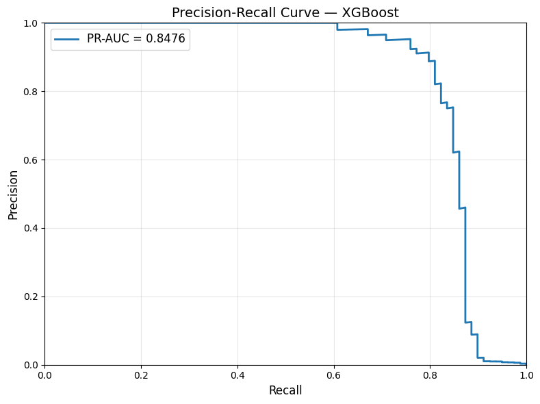
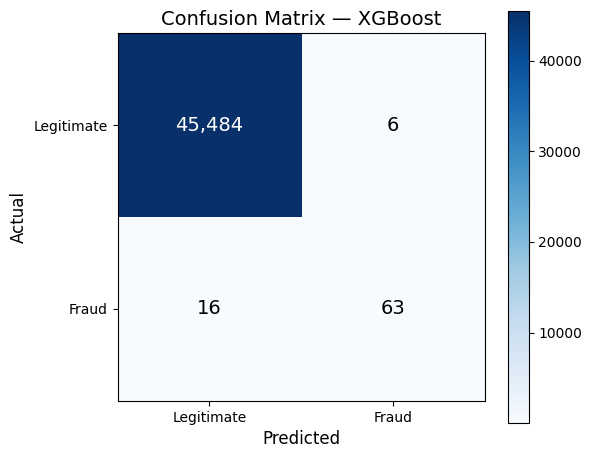

# Tabular ML

## Project Overview and Submission Draft

**Subtitle:** Credit Card Fraud Detection with End-to-End Tabular MLOps  
**Prepared:** April 21, 2026  
**Repository:** [github.com/h01t/tabular-ml](https://github.com/h01t/tabular-ml)  
**License:** MIT  

**Academic-project note:** This repository is a portfolio and academic demonstration built on the public Kaggle Credit Card Fraud Detection dataset. It is intended to show reproducible ML engineering, model evaluation, serving, and monitoring patterns rather than represent a production financial risk system.

---

## Executive Summary

This project demonstrates a complete machine learning workflow for fraud detection on highly imbalanced tabular data. The repository combines exploratory analysis, feature engineering, model training, hyperparameter tuning, ensemble evaluation, API deployment, experiment tracking, and drift monitoring in a single reproducible codebase.

The implementation focuses on the practical concerns that make tabular ML valuable in real applied settings:

- strong performance on imbalanced classification,
- transparent experiment structure,
- reusable preprocessing pipelines,
- deployable inference endpoints,
- lightweight operational monitoring,
- and documentation that can be handed off or submitted as a project artifact.

The current best standalone model is XGBoost by test PR-AUC, while the stacking ensemble slightly improves recall. The final repository is prepared for public presentation and later PDF export from this Markdown source.

## Problem Statement and Dataset Context

Fraud detection is a binary classification problem with extreme class imbalance: most transactions are legitimate and only a very small fraction are fraudulent. That makes metrics such as PR-AUC, precision, recall, and threshold calibration more useful than accuracy alone.

This project uses the [Kaggle Credit Card Fraud Detection dataset](https://www.kaggle.com/datasets/mlg-ulb/creditcardfraud), which contains:

- 284,807 transactions,
- 31 columns,
- 28 anonymized PCA-style features (`V1` to `V28`),
- a `Time` feature,
- an `Amount` feature,
- and a binary target column, `Class`.

The fraud rate is approximately **0.172%**, which makes the dataset a good fit for demonstrating imbalance-aware modeling and evaluation.

## System Architecture



The project is organized into a few clear subsystems:

- `data`: input loading and train/validation/test splits,
- `features`: reusable preprocessing and engineered features,
- `models`: tuning, evaluation, training, and ensemble logic,
- `api`: serving contract for inference,
- `monitoring`: drift detection and report generation,
- `docs`: public documentation and export-ready project overview.

## Data Preparation and Feature Engineering

The feature pipeline transforms the raw transaction schema into a training-ready representation while preserving compatibility with inference-time inputs.

Key steps:

1. Convert raw elapsed time into cyclical hour-of-day features.
2. Apply `log1p` and scaling to the transaction amount.
3. Create interaction features for selected high-signal PCA components.
4. Preserve the original anonymized feature set for tree-based learners.

This keeps the feature engineering lightweight, deterministic, and serializable with `joblib`, which is important for parity between training and serving.

### EDA Snapshot



*Figure 1. Severe class imbalance in the source dataset.*



*Figure 2. Focused feature correlation view from the exploratory notebook.*

## Training and Tuning Workflow

The modeling layer compares three gradient boosting libraries:

- XGBoost,
- LightGBM,
- CatBoost.

Each model is tuned with Optuna and then evaluated on validation and test splits using metrics that are meaningful for rare-event detection.



### Hardware Resolution Note

The repository now exposes a small hardware selection section in `configs/default.yaml`:

```yaml
training:
  hardware:
    preference: auto
```

Behavior:

- `auto` currently resolves to CPU for safety and reproducibility.
- Apple Silicon explicitly resolves to CPU because the active tree-model stack does not provide a native MPS path in this project.
- Explicit `gpu` mode preserves upstream library-specific GPU settings where available:
  - XGBoost via CUDA,
  - LightGBM via OpenCL or CUDA-enabled builds,
  - CatBoost via GPU mode.

This makes the project honest about Apple Silicon compatibility without pretending the current learners run through MPS.

## Inference and Serving

The serving layer is implemented with FastAPI and accepts raw transaction features matching the original dataset schema, excluding the target.

Supported endpoints:

- `GET /health`
- `POST /predict`
- `POST /predict/batch`

The API loads the preprocessing pipeline and selected trained model from centralized serving config rather than relying on scattered hardcoded constants.


This separation between raw input validation, feature transformation, and model inference keeps the API easy to test and easier to reason about during maintenance.

## Monitoring and Drift Workflow

The monitoring module uses Evidently to compare reference and current datasets and generate HTML drift reports. This is intentionally lightweight but useful for demonstrating how a trained model can be observed after deployment.



The repository also includes a monitoring demo script and tests for simulated drift scenarios such as mean shifts, scale changes, corruption, and missingness.

## Results

### Test-Set Comparison

| Model | PR-AUC | ROC-AUC | F1 | Precision | Recall |
|---|---:|---:|---:|---:|---:|
| XGBoost | 0.8672 | 0.9771 | 0.8817 | 0.9318 | 0.8367 |
| LightGBM | 0.8640 | 0.9708 | 0.8770 | 0.9213 | 0.8367 |
| CatBoost | 0.8376 | 0.9762 | 0.8265 | 0.8265 | 0.8265 |
| Stacking Ensemble | 0.8622 | 0.9782 | 0.8783 | 0.9121 | 0.8469 |
| Blending Ensemble | 0.8672 | 0.9771 | 0.8817 | 0.9318 | 0.8367 |

### Key Takeaways

- XGBoost is the strongest standalone model on PR-AUC.
- Stacking slightly improves recall, which can matter in fraud screening workflows.
- All models reach ROC-AUC above 0.97, indicating strong separation ability.
- Threshold selection matters materially because the operating point is more important than raw probability alone in imbalanced settings.



*Figure 3. Precision-recall performance for the current best standalone model.*



*Figure 4. Confusion matrix at the selected operating threshold.*

## Reproducibility and Setup

Recommended local setup:

```bash
python3 -m venv .venv
source .venv/bin/activate
python -m pip install --upgrade pip
python -m pip install -e ".[dev]"
```

Dataset download:

```bash
kaggle datasets download -d mlg-ulb/creditcardfraud -p data/raw/ --unzip
```

Run tests:

```bash
python -m pytest
```

Train and evaluate:

```bash
python -m tabular_ml.models.train_all
python -m tabular_ml.models.run_ensemble
```

Start the API:

```bash
uvicorn tabular_ml.api.app:app --reload --port 8000
```

### macOS Note

On macOS, especially when using XGBoost or LightGBM native wheels, OpenMP may be required:

```bash
brew install libomp
```

The repository’s unit tests have been refactored so they no longer require ignored local data files or pre-generated model artifacts. Optional native-library tests are clearly marked and skip when those dependencies are unavailable.

## Public Release Cleanup Summary

The repo cleanup for public release focused on five practical improvements:

1. richer package metadata in `pyproject.toml`,
2. an explicit MIT license,
3. centralized runtime config for serving metadata and training hardware,
4. safer optional imports so lightweight modules do not fail on machines without native ML dependencies,
5. documentation rewritten around a cleaner Python-first onboarding flow.

These changes make the project more presentable, easier to clone, and more honest about environment requirements.

## Limitations and Future Work

- The dataset is anonymized and PCA-transformed, so interpretability is limited.
- Monitoring is focused on data drift and does not yet include concept drift or prediction drift.
- The project is intentionally batch-oriented and does not include streaming infrastructure.
- GPU support is library-dependent and not unified across platforms.
- The API currently serves one selected trained model rather than dynamic model routing or version negotiation.

Reasonable future extensions would include scheduled retraining, richer operational dashboards, SHAP-based analysis, and benchmark comparisons with additional tabular baselines.

## Appendix

### A. Repository Deliverables

- `README.md`: public-facing repository landing page.
- `docs/project-overview.md`: submission-ready long-form overview.
- `docs/images/`: curated figures used in the overview.
- `configs/default.yaml`: documented configuration, including hardware and serving sections.
- `LICENSE`: MIT license.

### B. Mermaid Diagram Inventory

This overview includes Mermaid-compatible diagrams for:

- system architecture,
- training and tuning workflow,
- inference request flow,
- monitoring and drift workflow.

### C. PDF Export Note

This Markdown file is intentionally structured for later PDF conversion. For export, use a Markdown renderer that supports:

- standard GitHub-flavored Markdown,
- embedded images from `docs/images/`,
- Mermaid rendering before conversion if diagrams need to appear in the final PDF.

If you export with a tool that does not render Mermaid directly, generate diagram images first or use a renderer that supports Mermaid natively.
